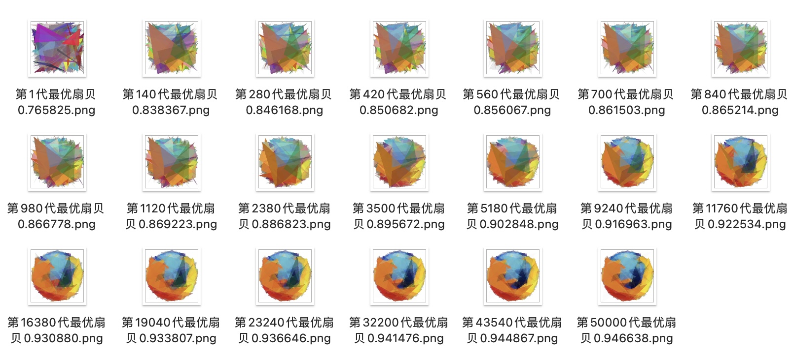
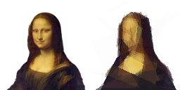
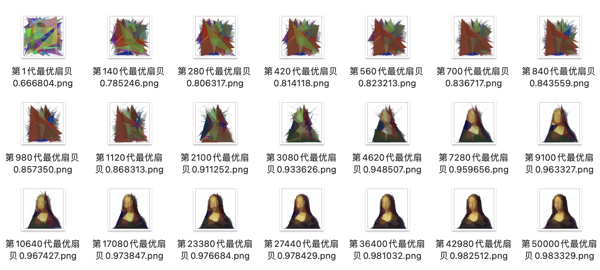

# GA-Firefox-

通过遗传算法使用150个半透明三角形绘制Firefox图标。（需要OpenCV环境，我的机器上用的OpenCV4.5.5）

## 实现方法

**参考[科学松鼠会 遗传算法：内存中的进化](http://songshuhui.net/archives/10462)的思路，下面是我的实现方法：**

### 创建初始群体

 1. 种群内扇贝个数设定为16。
 1. 每个扇贝壳上有150个半透明三角形。每个三角形的三个点与颜色随机生成。
 1. 使用OpenCV绘制该扇贝，与理想图片逐像素对比，计算出该扇贝适应度。

### 交叉

 1. 随机寻找两扇贝配对。
 1. 150个三角形内随机寻找n个三角形，两扇贝进行交叉操作。

### 变异

 1. 某个扇贝随机找到一个三角形，随机变异某个点的横纵坐标或颜色分量。

### 更新适应度

### 选择

 1. 淘汰适应度最低的两个扇贝。
 1. 为保持种群数量不变，其余扇贝内随机寻找两扇贝交叉补缺位。

### 运行参数

 1. 交叉率：0.86
 1. 变异率：0.1
 1. 迭代次数：180000
 1. 种群大小：16
 1. 三角形个数：150
 1. 像素差阈值：5

### 微调

 1. 选择算子：轮盘赌算法（容易早熟），淘汰最低两个交叉补缺位（目前所用的方法）。
 1. 变异算子：变异两个三角形，变异一个三角形（两方法差别不大）。
 1. 变异率：0.2（过高，种群适应度增长缓慢），0.1（目前所用的值）.
 1. 理想图像分辨率：128×128（目前所用的值）。

## 实验效果

Firefox理想图标及遗传算法最优扇贝：

Firefox遗传算法历代最优扇贝：

MonaLisa理想图标及遗传算法最优扇贝：

MonaLisa遗传算法历代最优扇贝：

